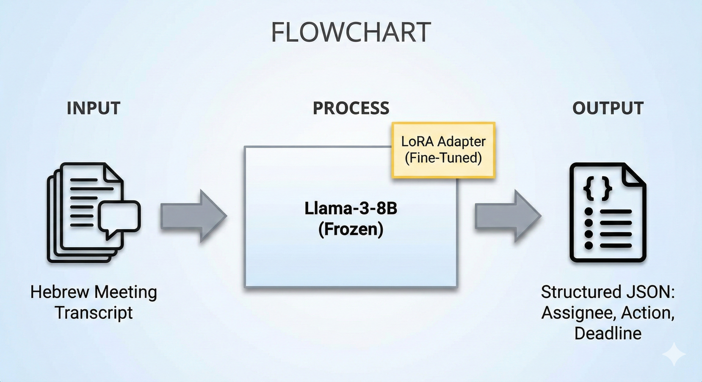

# ActionSense: Automated Task Extraction from Hebrew Meeting Transcripts

## 📌 Project Motivation
In the dynamic environment of the Israeli high-tech industry, meetings are often conducted in a mix of Hebrew and English ("Hebrish"), characterized by informal language, slang, and rapid context switches. Valuable action items are frequently lost in the noise of unstructured transcripts.
Existing State-of-the-Art (SOTA) models excel in formal English but struggle significantly with Hebrew morphology and the strict structural requirements (JSON) needed for automated task management systems.

## 🚧 Problem Statement
The primary challenge is the **"Language & Structure Gap"**:
1.  **Linguistic:** Small open-source models (like Llama-3-8B) often hallucinate or revert to English when processed with Hebrew instructions.
2.  **Structural:** Extracting a strictly formatted list of objects (Assignee, Action, Deadline) from chaotic text often results in invalid JSON syntax, rendering the output unusable for software integration.
3.  **Baseline Failure:** Zero-shot attempts with base models yielded ~1% accuracy

## 🖼️ Visual Abstract

*(A diagram illustrating the pipeline: From unstructured Hebrew audio transcript -> Fine-Tuned Llama-3 with LoRA -> Structured JSON Output)*

## 💾 Datasets
Since no public dataset exists for Hebrew/English organizational meetings, we created a specialized synthetic dataset.

* **Source:** Generated using a "Teacher Model" (GPT-4) simulating realistic Israeli team syncs.
* **Size:** 230 total samples.
    * **Train Set:** 200 samples.
    * **Test Set:** 30 samples.
* **Format:** `JSONL` files containing pairs of `input` (dialogue) and `output` (ground truth JSON).

### Data Augmentation & Generation Pipeline
We employed a robust **Synthetic Data Generation** strategy:
* **Task Banks:** The generation script (`create_dataset.ipynb`) utilizes a curated **Global Task Bank** (`Global_Task_Bank.txt`) and a **Hebrish Lexicon** (`Heblish_Task_Bank.xlsx`). This seeds the model with diverse technical jargon (e.g., "Deploy", "Bug", "PR") and authentic Hebrew slang (e.g., "Tishlach li", "Tisgor pina").
* **Diverse Scenarios:** The pipeline varies meeting contexts across R&D, Marketing, and HR domains to ensure generalization.

## 🔄 Input / Output Examples

**Input (Unstructured Dialogue):**
> **דני:** יוסי, תכין את המצגת למחר בבוקר?
> **יוסי:** אין בעיה, אני אשב על זה היום.
> **נועה:** אני אעבור על העיצוב אחר כך.

**Output (Structured JSON):**
```json
{
  "action_items": [
    {
      "assignee": "יוסי",
      "action": "להכין את המצגת",
      "deadline": "מחר בבוקר"
    },
    {
      "assignee": "נועה",
      "action": "לעבור על עיצוב המצגת",
      "deadline": "אחרי שיוסי יסיים"
    }
  ]
}
```

## 🧠 Models and Pipelines Used
We utilized a parameter-efficient fine-tuning approach to adapt a general-purpose LLM to this specific niche.

* **Base Model:** `unsloth/llama-3-8b-bnb-4bit` (Quantized to 4-bit for memory efficiency).
* **Architecture:** Decoder-only Transformer with **LoRA** (Low-Rank Adaptation) adapters.
* **Frameworks:**
  * `Unsloth`: For optimized backpropagation (2x faster training, 60% less memory).
  * `Hugging Face TRL`: For the Supervised Fine-Tuning (SFT) loop.
* **Inference Pipeline:** A custom Python script incorporating **Hungarian Matching** (scipy) to align predictions with ground truth and **Semantic Embeddings** (Sentence-Transformers) for scoring.

## ⚙️ Training Process and Parameters
The model was trained using the **"Train as you Test"** principle with the standard Alpaca prompt format.

| Parameter | Value | Reason |
| :--- | :--- | :--- |
| **Method** | QLoRA | Fits on consumer GPU (8GB VRAM) |
| **Rank (r)** | 16 | Balance between plasticity and file size |
| **Learning Rate** | 2e-4 | Standard for LoRA fine-tuning |
| **Batch Size** | 2 | Limited by GPU memory |
| **Gradient Accumulation** | 4 | Effective batch size of 8 |
| **Max Steps** | 60 | Approx 3 epochs (preventing overfitting) |
| **Optimizer** | AdamW 8-bit | Memory efficiency |
| **Max Sequence Length** | 512 | Sufficient for standard meeting excerpts |

## 📏 Metrics
Evaluating generative lists is complex. We developed a robust pipeline:

1.  **Alignment:** Used the **Hungarian Algorithm** to optimally match predicted tasks with ground truth tasks based on semantic similarity (solving the order issue).
2.  **Assignee Accuracy:** **Fuzzy String Matching** (Levenshtein Distance > 80%) to handle typos and slight name variations.
3.  **Action Similarity:** **Semantic Similarity** (Cosine Similarity using `AlephBERT` embeddings) to measure meaning rather than exact phrasing.
4.  **Deadline Accuracy:** **Soft String Matching** (Normalization & Containment) to handle relative time expressions vs. absolute dates.

## 🏆 Results

| Metric | Baseline (Zero-Shot) | Baseline (One-Shot) | **Fine-Tuned (Ours)** |
| :--- | :---: | :---: | :---: |
| **Assignee Accuracy** | 1.1% | 7.4% | **56.7%** |
| **Action Similarity** | 0.9% | 11.8% | **59.3%** |
| **Deadline Accuracy** | 0.0% | 6.9% | **35.1%** |

*Note: The Deadline score (35%) reflects the challenge of resolving relative dates (e.g., "next week") without a dedicated calendar tool.*

## 📂 Repository Structure

```text
├── Code/                         # Python scripts and notebooks
│   ├── outputs/                  # (Not included in repo - generated during training)
│   ├── create_dataset.ipynb      # Synthetic data generation notebook
│   ├── create_train_test_from_data.py
│   ├── 1_evaluate_baseline.py
│   ├── 1_evaluate_baseline_with_oneshot.py
│   ├── 2_train_model.py
│   ├── 3_evaluate_final.py
│   ├── graph_loss.py
│   └── Aggregate_and_visualize_results.py
├── Data/                         # Dataset files
│   ├── tasks/                    # Raw JSON tasks
│   ├── transcriptions/           # Raw CSV transcriptions
│   ├── Global_Task_Bank.txt      # Source templates for generation
│   ├── Heblish_Task_Bank.xlsx    # Source lexicon for generation
│   ├── train.jsonl               # Final Training Set
│   └── test.jsonl                # Final Test Set
├── Results/                      # Experiment logs and raw outputs
│   ├── baseline_analysis_results.csv
│   ├── baseline_detailed_report.txt
│   ├── baseline_oneshot_results.csv
│   ├── baseline_oneshot_report.txt
│   ├── loss_history.csv
│   ├── analysis_results.csv
│   └── final_detailed_report.txt
├── Visuals/                      # Images for README and presentation
│   ├── flow.png
│   ├── data_example.png
│   ├── loss_curve.png
│   └── results.png
├── Slides/                       # Project Slides (Proposals & interim & Final) - pdf amd pptx
│   ├── Project Proposal.pdf
│   ├── Project Interim.pdf
│   └── Project Final Presentation.pdf
├── requirements.txt              # Python dependencies
└── README.md                     # Project Documentation
```
## 👥 Team Members
* **Meir Weinberg**
* **Yael Reina**

---
*Submitted as part of the LLM Course Final Project, under the supervision of Dr. Alexander (Sasha) Apartsin.*
